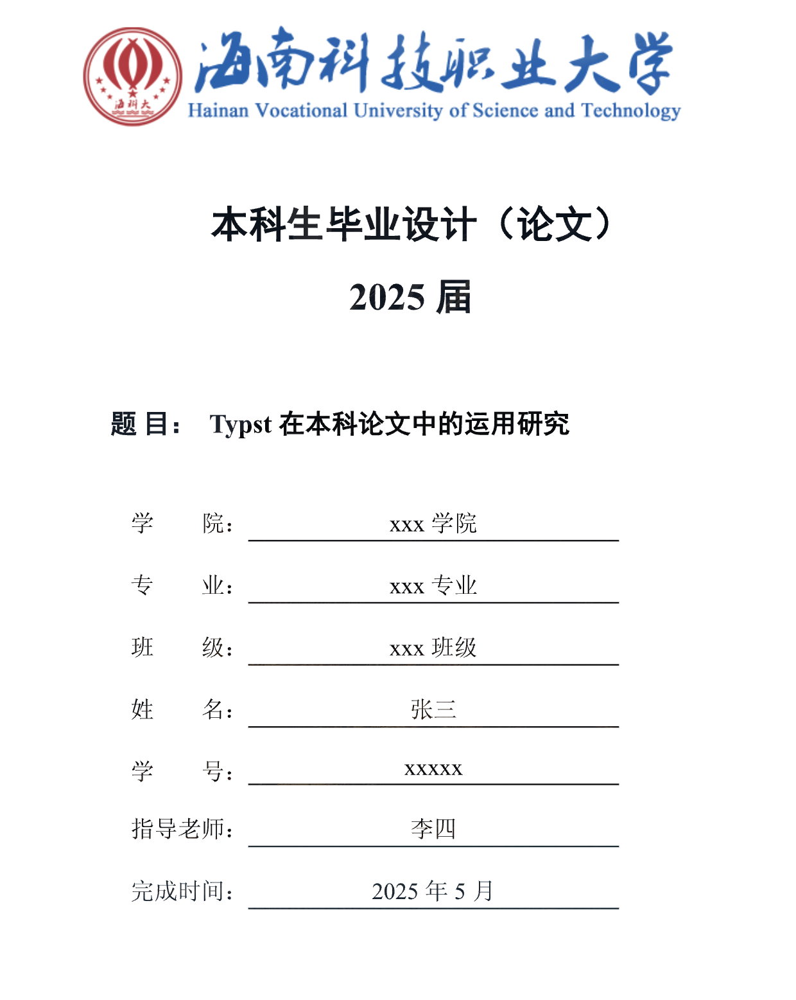

# 1. hnustsa-typst 海科大本科论文模板
This is the template of hnustsa

完整的 PDF [可在里获取](test.pdf)

# 2. Typst 是什么？
- Typst 是一种「新型标记语言」，主要面向专业文档排版领域；
- 优势：语法相对简洁、编译速度快（几乎可以实现所见即所得）、轻量级环境搭建、具有现代编程语言特性（支持函数、闭包等）‘’
- 劣势：Typst 作为新兴语言还没有像 MS、Latex 那样成熟稳定；

>! 个人认为最重要部分：官方文档可读性强 + 语言整体易于上手；

- 你可以从[此处](https://typst-doc-cn.github.io/docs/)快速了解 `Typst` 的基础语法并通过[官方文档](https://typst.app/docs/)进行更加深入的理解；

# 3. 使用方法

## 3.1 命令行编辑

- 从仓库进行克隆，下载并解压整个文件，安装最新版本的 `Typst`，并运行命令 `typst compile template-main.typ --font-path fonts` 即可编译；

## 3.2 Vscode 本地编辑（推荐）
- 打开 `Vscode` 安装插件 [Tinymist Typst](https://marketplace.visualstudio.com/items?itemName=myriad-dreamin.tinymist)  ;
- 将解压缩的文档拖入 Vscode 中，找到 `template-main.typ` 文件；
- 按下快捷键 `Ctrl + K + V`(Windows) 或 `Command + K + V`(MacOS) 或点击右上角按钮，即可进行编译和预览；

## 3.3 官方在线编辑（不推荐）
- 官方也提供了 [Web App](https://typst.app/) 的支持，但是需要手动上传「中文字体」文件；

# 4. 拓展功能

## 4.1 数学公式快速输入

在 `Vscode`中下载 [HyperSnips](https://marketplace.visualstudio.com/items/?itemName=draivin.hsnips) 插件，并将 `snippets/typst.hsnips` 文件内容

实现「快速输入」

## 4.2 图像快速生成

该模板引入了第三方包 [Lilaq](https://lilaq.org/) 和 [cetz-plot](https://github.com/cetz-package/cetz-plot) 并自定义的相关函数来支持图表的快速生成，具体可参考 `extra-function/set-plot.typ`中的代码内容；

# 注意事项：

1. 权威性问题：模板按照「2025 届海南科技职业大学本科毕业论文模板要求」格式进行编排，但部分内容存在「主观成分」且不同学院之间模板内容插在些许差异，可能存在些许 `bug` 欢迎在 `issue` 提问交流。
2. 后期维护：由于个人精力有限，希望有兴趣的人进行 `fork` ；

# 参考内容
- [typst-documents](https://typst.app/docs/) - 官方文档
- [pkuthess-typst](https://github.com/pku-typst/pkuthss-typst) - 北京大学学位论文 Typst 模板
- [HUST-typst-template](https://github.com/werifu/HUST-typst-template) - 华科毕业设计（本科）的 typst 模板
- [SHU-Bachelor-Thesis-Typst](https://github.com/shuosc/SHU-Bachelor-Thesis-Typst?tab=readme-ov-file) - 上海大学本科毕业论文 typst 模板 (开发ing)
- [The Raindrop-Blue Book（Typst中文教程）](https://typst-doc-cn.github.io/tutorial/) - 蓝皮书
- [typst-examples-book](https://github.com/sitandr/typst-examples-book?tab=readme-ov-file) - Typst Examples Book Typst 示例手册

## 使用指南

  

asd

