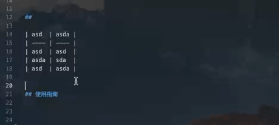

# 1. hnustsa-typst 海科大本科论文模板
This is the template of hnustsa

完整的 PDF [可在里获取](test.pdf)

# 2. Typst 是什么？
- Typst 是一种「新型标记语言」，主要面向专业文档排版领域；
- 优势：语法相对简洁、编译速度快（几乎可以实现所见即所得）、轻量级环境搭建、具有现代编程语言特性（支持函数、闭包等）‘’
- 劣势：Typst 作为新兴语言还没有像 MS、Latex 那样成熟稳定；

>! 个人认为最重要部分：官方文档可读性强 + 语言整体易于上手；

# 3. 使用方法

## 3.1 命令行编辑

- 从仓库进行克隆，下载并解压整个文件，安装最新版本的 `Typst`，并运行命令 `typst compile template-main.typ --font-path fonts` 即可编译；

## 3.2 Vscode 本地编辑（推荐）
- 打开 `Vscode` 安装插件 [Tinymist Typst](https://marketplace.visualstudio.com/items?itemName=myriad-dreamin.tinymist)  ;
- 将解压缩的文档拖入 Vscode 中，找到 `template-main.typ` 文件；
- 按下快捷键 `Ctrl + K + V`(Windows) 或 `Command + K + V`(MacOS) 或点击右上角按钮，即可进行编译和预览；

## 3.3 官方在线编辑（不推荐）
- 官方也提供了 `Web APP`  的支持，但是需要手动上传「字体」文件；

# 拓展功能

## 数学公式快速输入

配合 [HyperSnips](https://marketplace.visualstudio.com/items/?itemName=draivin.hsnips) 插件，实现「快速输入」

## 图像快速生成

模板引入了第三方包 ``

# 注意事项：

1. 字体问题：注意：由于 GitHub 单次文件上传无法超过 10MB 的限制，此处的相关中文字体（即：FangSong.ttf、SimHei.ttf、SimSun.ttf）可以从专门的字体处进行下载 ()[]；
2. 权威性问题：模板按照「2025 届海南科技职业大学本科毕业论文模板要求」格式进行编排，但部分内容存在「主观成分」且不同学院之间模板内容插在些许差异，可能存在些许 `bug` 欢迎在 `issue` 提问交流。
3. 后期维护：由于个人精力有限，希望有兴趣的人进行 `fork` ；
4. 

# 参考内容

## 

| asd  | asda |
| ---- | ---- |
| asd  | asd  |
| asda | sda  |
| asd  | asda |
asdasd

## 使用指南

  

asd

